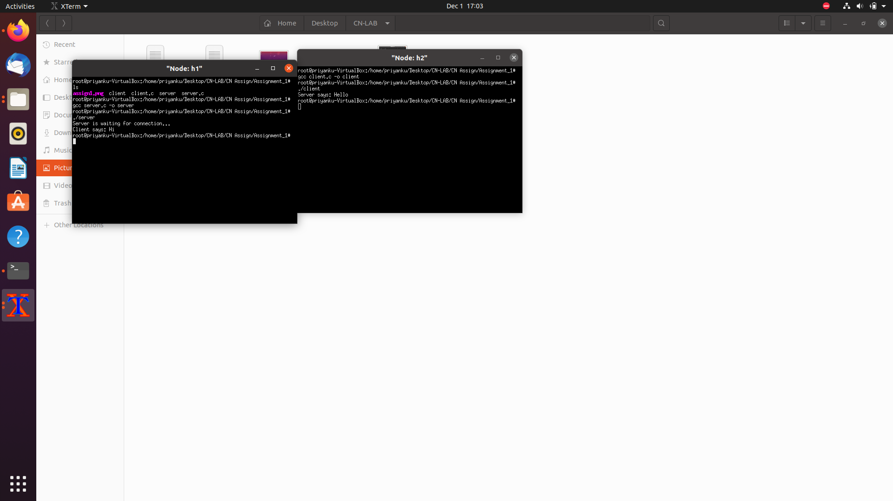

CN Lab – Assignment 1
Objective:
To gain first hands on experience of basic Socket Programming.
 
Exercise: 
Write a program to run TCP client and server socket programs where client first 
says “Hi” and in response server says “Hello”.
Steps/ Hints: (if any): 
1. Create two mininet hosts, 
2. Open the hosts individually in xterm windows,
3. In one host, run tcpserver program and then in another run the tcpclient.
Learning Outcomes: 
1. Basics of TCP client and server programming.

output screenshot 

