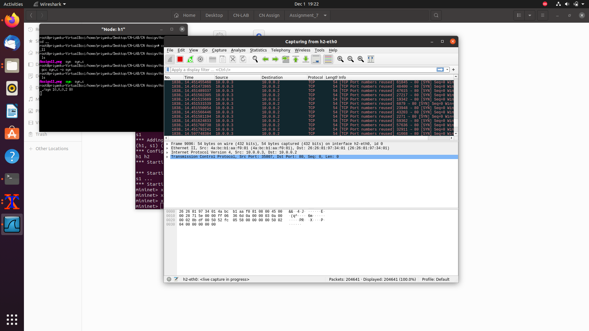

Assignment 11: 
Objective:
Using RAW sockets to generate TCP flooding attack.
 
 
Exercise: 
Write a RAW socket program to generate TCP SYN flood based DDoS attack 
towards an IP address. Take four mininet hosts as agent devices.
Steps/ Hints: (if any)
1. Use RAW socket to create your TCP SYN message with user given header. 
2. Use a total of six mininet hosts. One will be attacker, one for the victim and four 
as spoofed agent devices for communicating with the victim.
Learning Outcomes: 
1. Use of RAW sockets to generate SYN based flooding attack.
2. Understanding the pattern of TCP control messages for DDoS attack.

