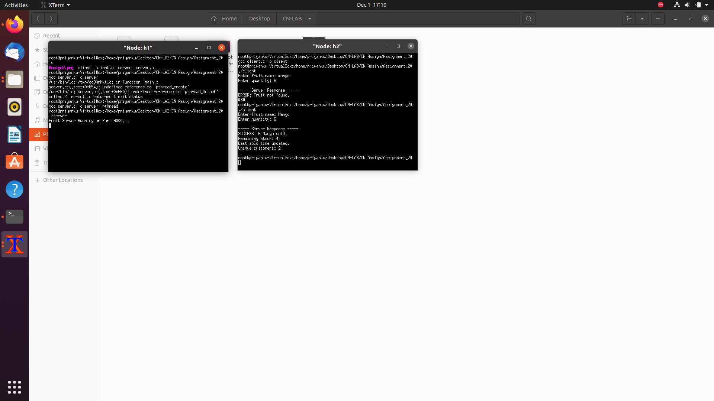

CN Lab – Assignment 2
Objective:
To gain experience of TCP Socket Programming for simple applications.
 
Exercise: 
Write a program using TCP socket to implement the following: 
i. Server maintains records of fruits in the format: fruit-name, quantity Last-sold,
(server timestamp), 
ii. Multiple client purchase the fruits one at a time,
iii. The fruit quantity is updated each time any fruit is sold, 
iv. Send regret message to a client if therequested quantityof the fruit is not 
available. 
v. Display the customer ids <IP, port> who has done transactions already. This 
list should be updated in the server every time a transaction occurs.
vi. The total number of unique customers who did some transaction will be 
displayed to the customer every time.
Steps/ Hints: (if any)
1. Use at least two mininet hosts as clients, 
2. Server must be kept running using a loop condition,
3. Take another socket (from accept() call) for keeping client information,
4. Server must send the current stock information to the transacting host as queried 
in the question.

