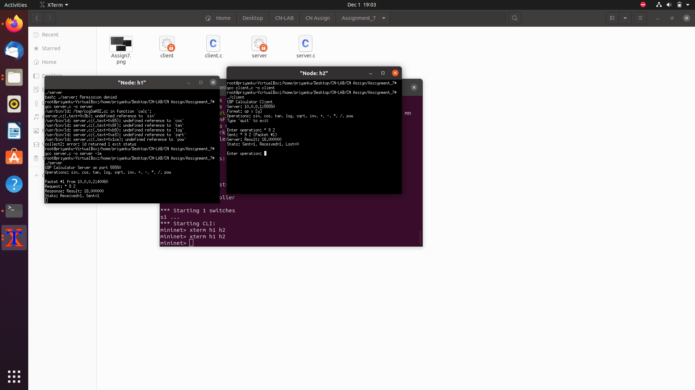

Assignment 7: 
Objective:
Client server communication with UDP packets
 
 
Exercise: 
Write UDP client server socket program where client sends one/two number(s) 
(integer or floating point) to server and a scientific calculator operation (like 
sin,cos,*,/, inv etc.) and server responds with the result after evaluating the value of 
operation as sent by the client. Server will maintain a scientific calculator. Detect in 
the mininet hosts with wireshark if there is any packet loss? Show it to the TA.
Steps/ Hints: (if any)
1. Use Math.h library in the server side to compute mathematical expressions.
2. Client will send expressions like – sin(x), x+y etc. and server will respond with the 
answer to the client.
3. Use UDP in a graceful manner to detect any packet loss, if occurs.
4. Run wireshark at the mininet host’s ethernet to capture packet and detect losses.
Learning Outcomes: 
1. Understanding reliability of UDP for transactions.

