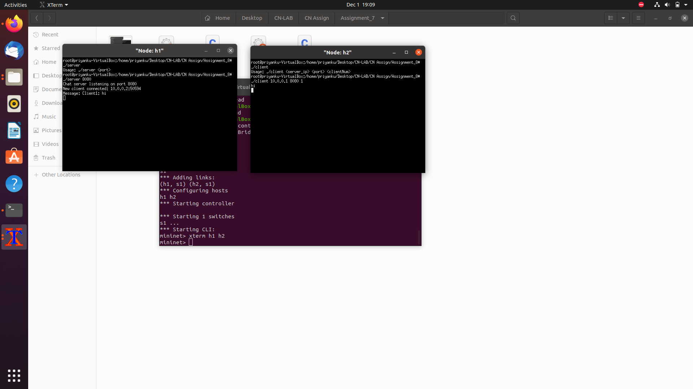

Assignment 8: 
 
Objective:
Using Thread library and TCP sockets. 
 
 
Exercise: 
Write a program in C using thread library and TCP sockets to build a chat server 
which enable clients communicating to each other through the chat server. Message 
logs must be maintained in the server in a text file. Each client will see the 
conversations in real time. Clients must handled by a server thread. (Keep it like a 
group chatbox)
Steps/ Hints: (if any)
1. In server-side, use:
while( (newfd = accept(sockfd, (struct sockaddr *)&client, (socklen_t*)&c)) )
{
printf("Accepted");
if( pthread_create( &thread_id, NULL, client_handler, (void*) &newfd) < 0)
{
perror("Thread error");
return 1;
};
}
2. Maintain a log.txt file in the server for saving conversations with timestamps.
Conversations will be fetched to all the clients automatically.
Learning Outcomes: 
1. Understanding multi-threading for TCP sockets.

2. 
