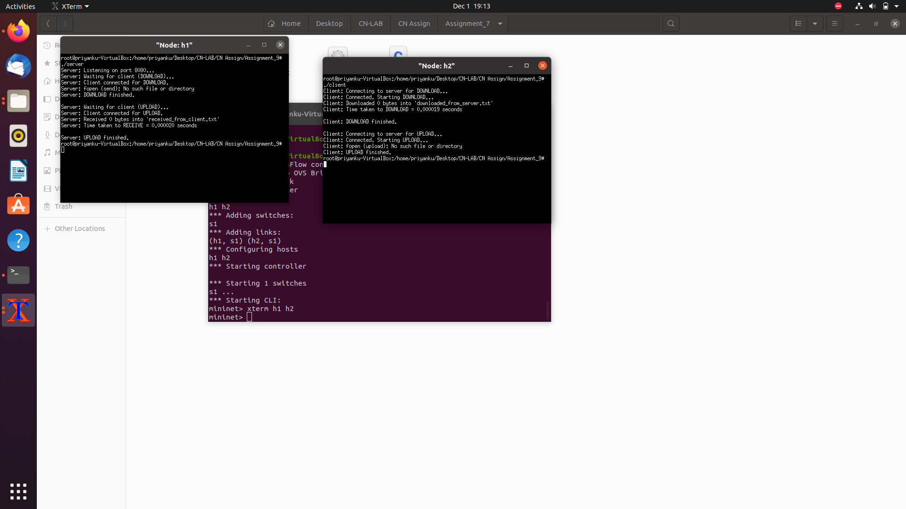

Assignment 9: 
Objective:
File upload and download using TCP.
 
 
Exercise: 
Write a client server socket program in TCP for uploading and downloading files
between two different hosts. Also calculate the transfer time in both the cases.
Steps/ Hints: (if any)
1. Create two directories in the system where mininet is running. 
2. Xterm mininet hosts and open client and server from two different directories.
3. Keep a file in the server directory and another file in the client directory.
4. First, client will download the server file to store in its directory.
5. Second, client will upload its file to the server directory.
6. Use time.h to check the transfer time in both the case. Display time taken in the 
client and server side.
Learning Outcomes: 
1. Use of TCP for file transfer.

2. 
